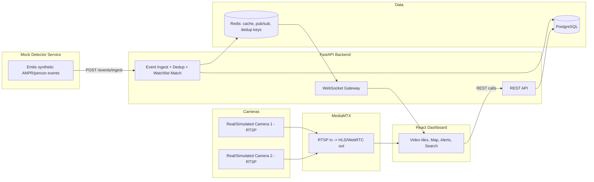
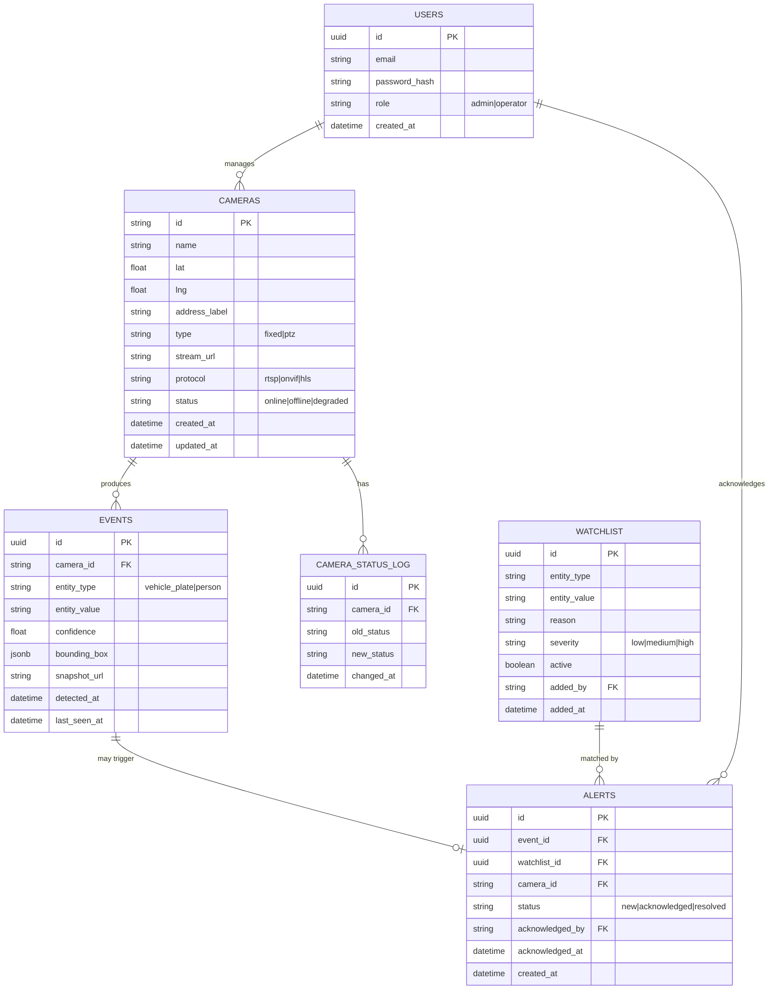
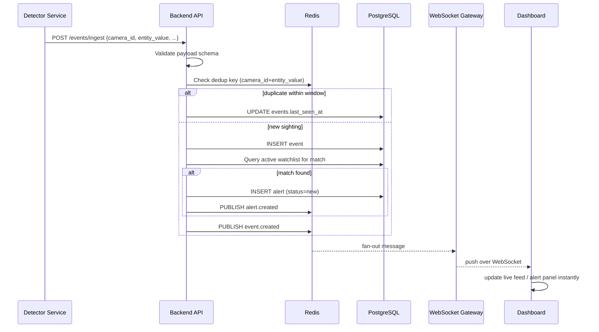

# ARCHITECTURE & WORKFLOW — Unified Camera Intelligence Platform

> **Note on this copy:** This document describes the target architecture
> (including Redis/Kafka as the real-time bus). The actual code in this
> repo is a Docker-free prototype that uses SQLite instead of Postgres and
> an in-process WebSocket broadcaster instead of Redis — see the root
> `README.md` for exactly what's real vs. simplified in this build, and the
> "SWAP-IN POINT" comments in `backend/app/dedup.py` and
> `backend/app/websocket_manager.py` for how to upgrade to the design below.

## 1. High-Level Component Diagram



## 2. Entity-Relationship Diagram



## 3. Event Lifecycle (Sequence)



## 4. Where a Real AI Model Plugs In

The mock `detector-service` is the **only** component a real ANPR/person
detection model replaces. It must keep POSTing the exact same JSON contract
(Section 4.5 of `PROJECT_PROMPT.md`) to `/events/ingest`. Nothing downstream
(backend validation, dedup, watchlist matching, alerting, dashboard) needs to
change. This boundary is what keeps "no model training" honest while still
producing a realistic, wire-compatible system.

## 5. Deduplication Logic (detail)

1. On each incoming event, compute key `dedup:{camera_id}:{entity_value}`.
2. If the key exists in Redis (TTL = dedup window, default 30s):
   - Update the existing `events.last_seen_at` in Postgres.
   - Do **not** insert a new event row.
   - Do **not** create a new alert if one is already `new` or
     `acknowledged` for that event.
   - Refresh the Redis key's TTL (sliding window).
3. If the key does not exist:
   - Insert a new `events` row.
   - Set the Redis key with the TTL.
   - Proceed to watchlist matching as normal.

## 6. Movement Tracking Query

Given an `entity_value` (e.g., a plate number), movement tracking is simply:

```sql
SELECT e.detected_at, c.name, c.lat, c.lng
FROM events e
JOIN cameras c ON c.id = e.camera_id
WHERE e.entity_value = :value
ORDER BY e.detected_at ASC;
```

The frontend draws a polyline through the resulting `(lat, lng)` points in
order and drops a timestamped marker at each stop. No separate "tracking
engine" is needed at this scale — see `SCALABILITY_AND_SECURITY.md` for how
this changes at 80,000 cameras.

## 7. Folder Structure

```
/backend
  /app
    /api          # route modules: cameras, events, alerts, watchlist, auth
    /core         # config, security, websocket manager
    /models       # SQLAlchemy models
    /schemas      # Pydantic schemas
    /services     # dedup, watchlist matching, health-checker
  /migrations     # Alembic
  /tests
/frontend
  /src
    /components   # VideoTile, MapView, AlertPanel, SearchBar, EventTable
    /hooks        # useWebSocket, useCameras, useAlerts
    /pages        # Dashboard, CameraRegistry, Login
/camera-simulator
  docker-compose fragment + ffmpeg configs for 2 synthetic streams
/detector-service
  main.py         # emits synthetic events on an interval
/docs
  diagrams, ER exports
docker-compose.yml
README.md
```
